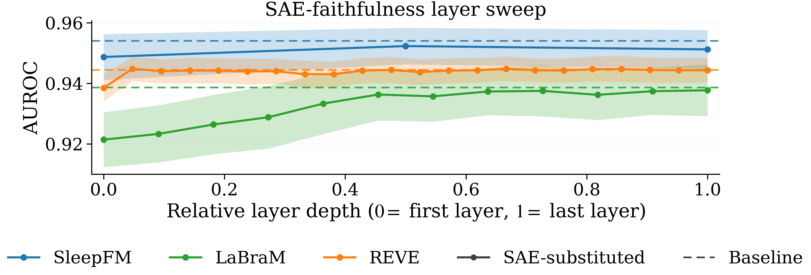

# Figure 2 — SAE-faithfulness layer sweep

> Test AUROC of a linear probe trained via 5-fold cross-validation on mean-pooled embeddings of each finetuned encoder, as layer-ℓ activations are replaced by their TopK-SAE reconstructions and ℓ sweeps through every transformer block.



## Regenerate

```bash
uv run python "tools/paper_figures/Figure 2/plot.py"
```

Self-contained: reads `data.json` next to the script. Produces `figure.png` and `figure.pdf` that match the submitted version byte-for-byte.

## Data provenance

`data.json` is the 5-fold-CV summary produced by `tools/probe_layer_sweep_kfold.py` in the development repo. Schema: one entry per encoder with `n_layers_total`, `by_layer` (per-layer mean / std AUROC), and a `baseline` block.
