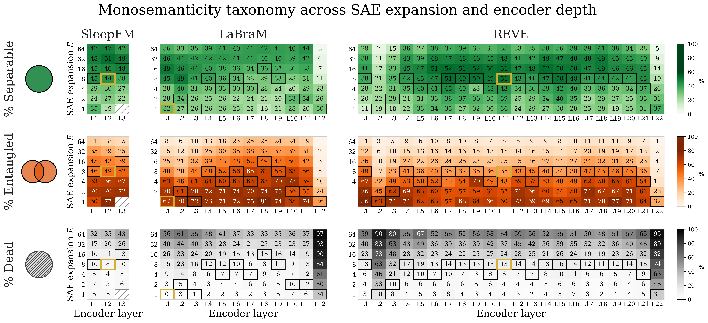

# Figure 3 — Monosemanticity taxonomy

> Per-encoder grid of the fraction of concept-enriched SAE features in each of three taxonomy classes (Separable / Entangled / Dead), across layers × expansion factors. Highlights the optimal (ℓ*, E*) operating point per encoder.



## Regenerate

```bash
uv run python "tools/paper_figures/Figure 3/plot.py"
```

Self-contained: reads `data.json` (30 KB, 258 experiment entries) next to the script. Visually identical to the submitted version. The md5 may not match byte-for-byte due to matplotlib version-drift in PNG encoding, but the image content and dimensions are the same.

## Data provenance

`data.json` is a `{exp_name: {separable, entangled, dead}}` lookup table. Each entry is the output of `_classify(feature_meta_enrichment, fire_rates_pct=..., expected_rate_pct=...)` applied to the corresponding `taxonomy_cache.pt` (or `app_cache.pt`) in the development repo's `results/experiments/{exp_name}/` directory.

The 258 entries cover:
- SleepFM: layers {0,1,2} × expansions {1,2,4,8,16,32,64}
- LaBraM: layers {0..11} × expansions {1,2,4,8,16,32,64}
- REVE: layers {0..21} × expansions {1,2,4,8,16,32,64}

(LaBraM and REVE at E=32, E=64 for some layers are intentionally missing — no SAE was trained there — and render as hatched cells.)
