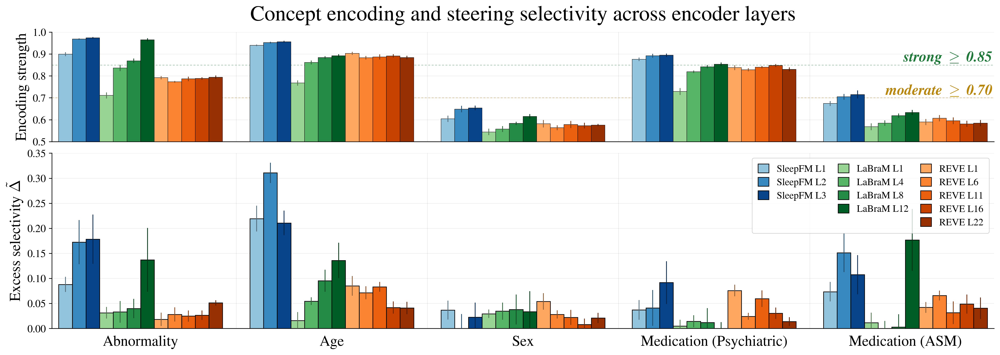

# Figure 4 — Cross-model concept encoding & steering selectivity

> Per-encoder, per-layer encoding strength (top panel) and steering selectivity (bottom) for 6 clinical concepts (Age, Pathology, Sex, Epileptic Activity, ASM medication, Psychiatric medication).



## Regenerate

```bash
uv run python "tools/paper_figures/Figure 4/plot.py"
```

Self-contained (default `--plot-only` behaviour): reads `data.npz` next to the script. Produces `figure.png` and `figure.pdf` byte-identical to the submitted version.

Pass `--recompute` to fall through to the on-the-fly computation path that needs `results/steering_cache/{exp}/steering_cache.pt` from the development repo (not shipped here).

## Data provenance

`data.npz` is the per-(concept, encoder-layer) steering metric cache produced by repeated runs of the cross-model steering pipeline (`tools/build_steering_cache.py` + the bar-chart computation in this script). Entries map `{(concept, exp)}` → serialised `{steps, target_auc, off_target_auc, baseline_*, ...}` dicts.
