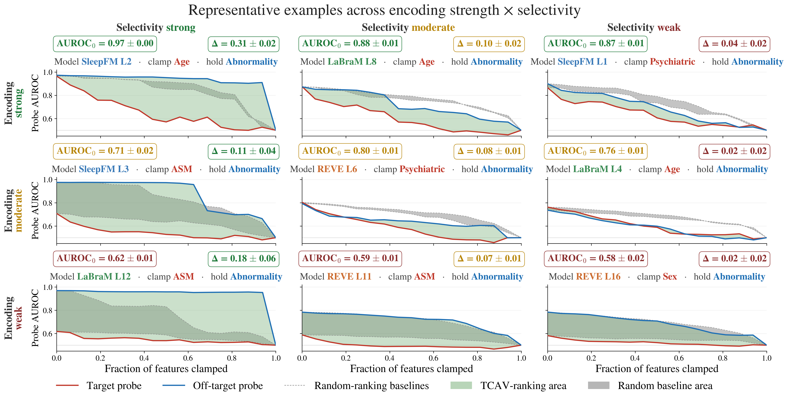

# Figure 5 — Steering sweeps across the encoding-selectivity landscape

> 9 representative (encoder × layer) configurations arranged by encoding strength (rows) × selectivity Δ̃ (columns). Each panel tracks target (red) and off-target (blue, Pathology) AUROC as the clamping fraction f increases.



## Regenerate

```bash
uv run python "tools/paper_figures/Figure 5/plot.py"
```

Self-contained: reads `data.npz` (shared format with Figure 4 — same cache file copied here for self-containment). Produces `figure.png` and `figure.pdf` byte-identical to the submitted version.

## Data provenance

Same source data as Figure 4 (`cross_model_steering_concepts_data_v4.npz`). Figure 5 selects 9 (concept, exp) entries from the cache and draws them as a 3×3 grid.
