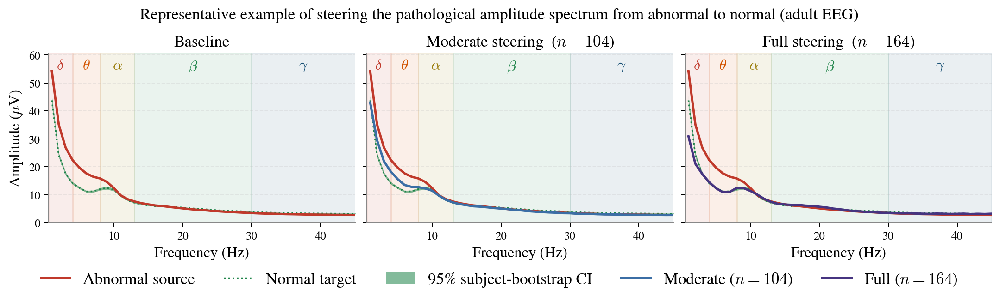

# Figure 6 — Spectrum-level concept steering (abnormal → normal)

> SleepFM layer 2, E=8. Shading denotes 95% bootstrap CIs on the target mean.
> **Left:** Baseline abnormal source vs. normal target centroid.
> **Centre & Right:** Decoded spectrum after clamping the top n=104 and n=164 TCAV-aligned features to the target centroid.



## Regenerate

```bash
uv run python "tools/paper_figures/Figure 6/plot.py"
```

Self-contained: reads `data.npz` (7 KB) next to the script. Produces `figure.png` and `figure.pdf` byte-identical to the submitted version.

## Data provenance

`data.npz` bundles the pre-decoded spectra for:

- Source mean: SleepFM L2 abnormal-EEG token embeddings decoded through SAE + XAE
- Target mean ± 95% subject-bootstrap CI: normal-EEG token embeddings decoded the same way (across 579 subjects)
- Two steered spectra (n=104 and n=164 top TCAV-ranked features clamped to the target centroid)
- Metric values M1 (spectral-distance reduction) and M2 (probe-recovery score)

Extraction was done from the development repo using the per-experiment app cache (`metadata.json` + `app_cache.pt`), the trained SAE checkpoint, the trained XAE checkpoint (~66 MB; stored in cloud bucket — not shipped), and the steering cache. The result is a 7 KB npz that fully specifies the figure.
