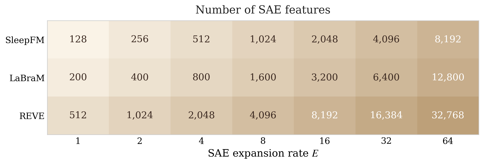

# Figure 7 (appendix) — SAE dictionary size

> Number of SAE features across 3 encoders × 7 expansion rates. |D| = E × d.



## Regenerate

```bash
uv run python "tools/paper_figures/Figure 7/plot.py"
```

The script is fully self-contained — encoder embedding dimensions and expansion rates are hardcoded constants in `plot.py`. No external data needed.

Outputs `figure.png` and `figure.pdf` next to the script. The committed `figure.png` is byte-identical to the version in `paper/final_neurips_submission/figures/dictionary_size.png`.
